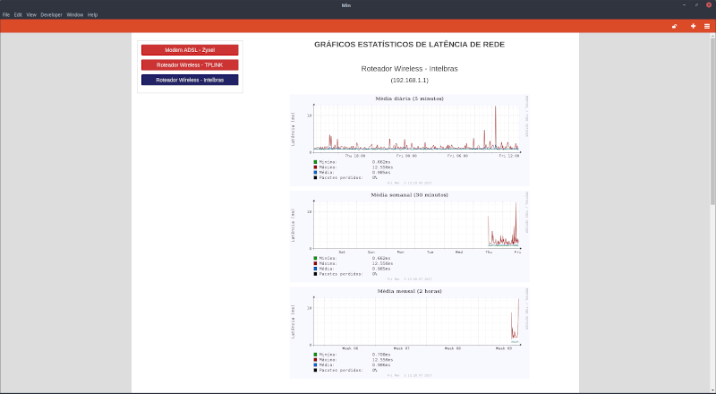

# Round-trip time (RTT) ping measurement with Bash and RRDtool
Shell bash script that using RRDTool generates daily, weekly, monthly and annual statistical graphs of round-trip time ping on the monitored equipaments, all in a very simple way.
## Development
### This project was developed and tested in the following environment:
```
- GNU/Linux 4.18.0-147.5.1.el8_1.x86_64 - CentOS Linux release 8.1.1911 (Core)
- GNU bash, version 4.4.19(1)-release (x86_64-redhat-linux-gnu)
- GNU coreutils 8.30
- RRDtool 1.7.0
- lighttpd/1.4.55
- GNU Awk 4.2.1
- grep (GNU grep) 3.1
- ping (iputils-s20180629)
```
## Setup
### 1 - Edit "rrd-rttping.sh" and change GLOBAL VARIABLES as needed
### 2 - Grant permission to execute the script
```
chmod 755 rrd-rttping.sh
```
### 3 - Run the script to generate the databases
```
./rrd-rttping.sh
```
### 4 - Run again, to generate the html pages
```
./rrd-rttping.sh --html
```
### 5 - Schedule the update task in crontab
```
*/5 * * * * /path/to/rrd-rttping.sh >&- 2>&-
```
Finally, access the generated html pages through a web browser.



*P.S. Sorry for the bad translation... Yes, I used Google Translate.*  :bow: